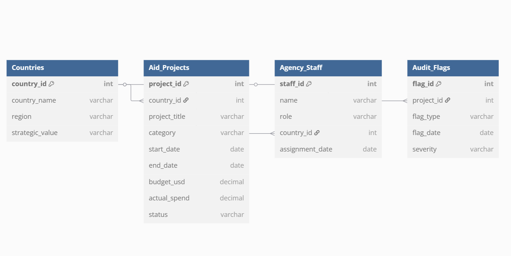

# Foreign Aid Data Analysis Project

This project simulates a foreign aid data tracking and risk analysis system, designed in SQL. It mimics the type of digital infrastructure and intelligence analysis used by agencies for organizing and auditing international programs.

## 📊 Project Objective

To design and analyze a relational database that tracks foreign aid programs, associated audit flags, government staff assignments, and overall country risk metrics.

## 🧱 Schema Overview

The project includes 4 related tables:
- `Countries`: Strategic focus regions
- `Aid_Projects`: Funding details per initiative
- `Agency_Staff`: Assigned diplomatic/technical staff
- `Audit_Flags`: Risk indicators and audit concerns

## 🛠 Tools & Technologies

- SQL (MySQL / SQLite compatible)
- Excel (for mock data generation)
- dbdiagram.io (for schema)
- Power BI

## Power BI Dashboard

## Insights and Takeaways
- Structure normalized data for real-world monitoring systems
- Writing clean, optimized SQL for analysis and reporting
- Creating views and multi-table joins for scalable insights
- Showing realistic use cases for government or intelligence systems

